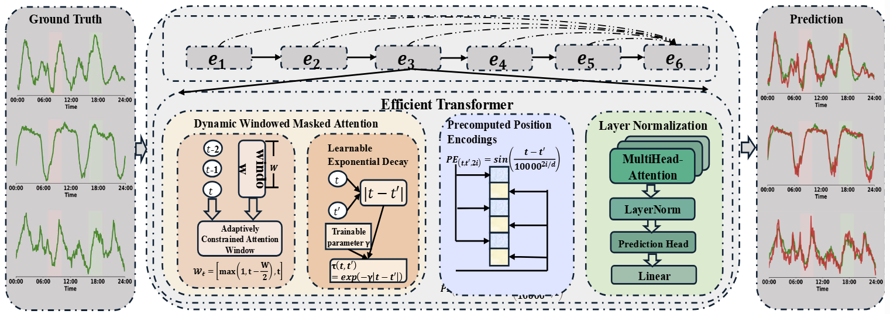

# AutoHFormer: Efficient Hierarchical Autoregressive Transformer for Time Series Prediction
## Overall Architecture

AutoTime adopts a hierarchical autoregressive framework. The prediction horizon is divided into segments, enabling the model to first generate coarse global predictions and then refine them step by step, effectively capturing both global and local dependencies.

<p align="center">
  
</p>

---

## Pseudo-code

The following pseudo-code illustrates the core workflow of AutoTime, including segment-level generation, windowed attention, and adaptive decay.

<p align="center">
  
</p>

---

## Experiments
### Comparison to Benchmark
AutoTime achieves state-of-the-art results on several standard time series forecasting benchmarks, significantly outperforming existing methods.

<p align="center">
  
</p>

---

## How to run
1. Install requirements. ```python3 -m pip install -r requirements.txt```

2. Dataset Preparation. All the datasets are in ```./datasets```.

3. Training. To run experiments on other datasets, just execute the corresponding script:
```bash
bash scripts/Electricity/AutoHFormer.sh
bash scripts/Weather/AutoHFormer.sh
bash scripts/PEMS04/AutoHFormer.sh
```

4. Results.
All experiment logs are saved under `logs/LongForecasting/`
