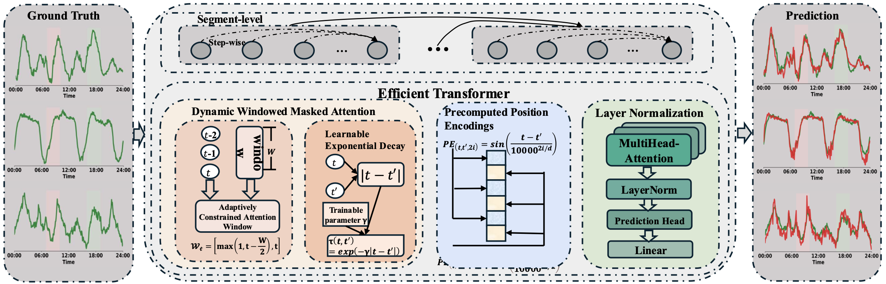
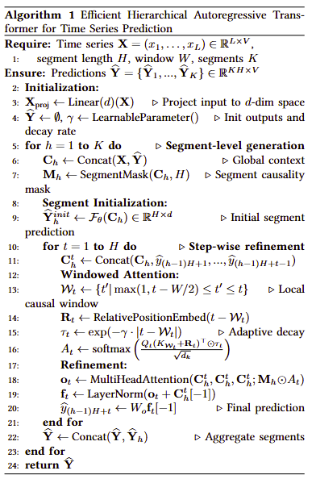
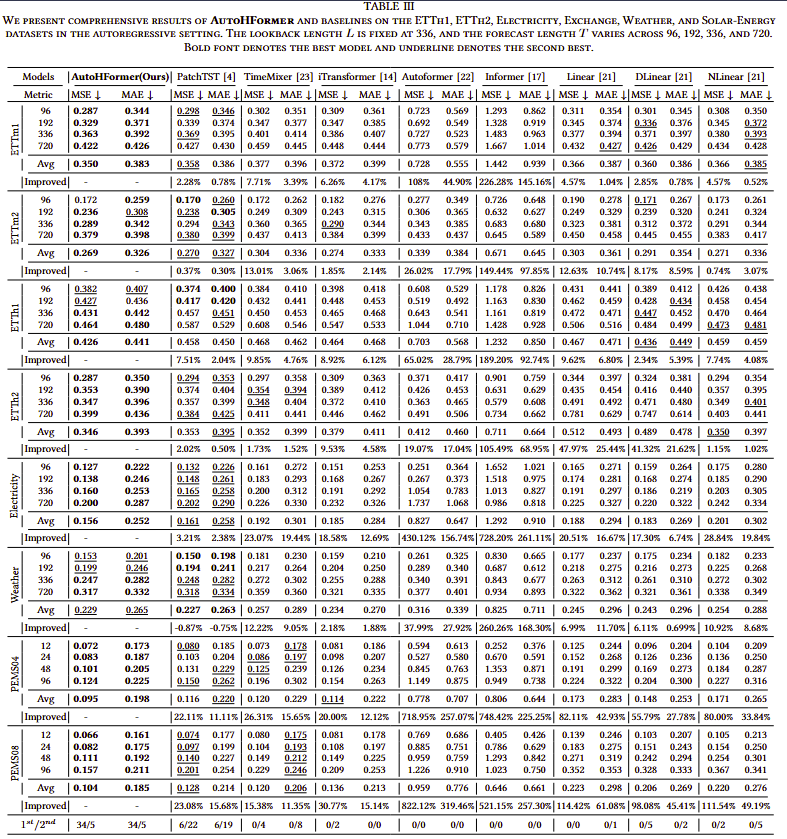

# AutoHFormer: Efficient Hierarchical Autoregressive Transformer for Time Series Prediction

Modern time series forecasting demands architectures that simultaneously address three critical requirements: non-strict temporal causality for reliable decision-making, sub-quadratic complexity for practical deployment, and multi-scale pattern recognition for accurate predictions. We present AutoHFormer, a novel hierarchical autoregressive transformer that advances the state-of-the-art through three fundamental innovations. First, our hierarchical decomposition combines segment-level block processing with intra-segment sequential refinement, resolving the inherent tension between computational parallelism and temporal coherence. Second, the dynamic windowed attention mechanism implements learnable causal windows with exponential temporal decay, reducing computational complexity while maintaining precise local-global feature integration. Third, the dual-phase training protocol separates initial segment prediction from iterative error correction, mitigating the error propagation characteristic of conventional autoregressive approaches. Extensive evaluations demonstrate these innovations collectively achieve unprecedented performance, delivering at least 11.11% MAE reduction on traffic flow benchmarks. The framework's unique combination of hierarchical processing, efficient attention, and robust training establishes new capabilities for industrial-scale time series analysis.

## Overall Architecture

AutoHFormer adopts a hierarchical autoregressive framework. The prediction horizon is divided into segments, enabling the model to first generate coarse global predictions and then refine them step by step, effectively capturing both global and local dependencies.

<p align="center">
  
</p>

## Pseudo-code

The following pseudo-code illustrates the core workflow of AutoHFormer, including segment-level generation, windowed attention, and adaptive decay.

<p align="center">
  
</p>

## Experiments
### Comparison to Benchmark
AutoHFormer achieves state-of-the-art results on several standard time series forecasting benchmarks, significantly outperforming existing methods.

<p align="center">
  
</p>

## How to run
1. Install requirements. ```python3 -m pip install -r requirements.txt```

2. Dataset Preparation. All the datasets are in ```./datasets```.

3. Training. To run experiments on other datasets, just execute the corresponding script:
```bash
bash scripts/Electricity/AutoHFormer.sh
bash scripts/Weather/AutoHFormer.sh
bash scripts/PEMS04/AutoHFormer.sh
```

4. Results.
All experiment logs are saved under `logs/LongForecasting/`
